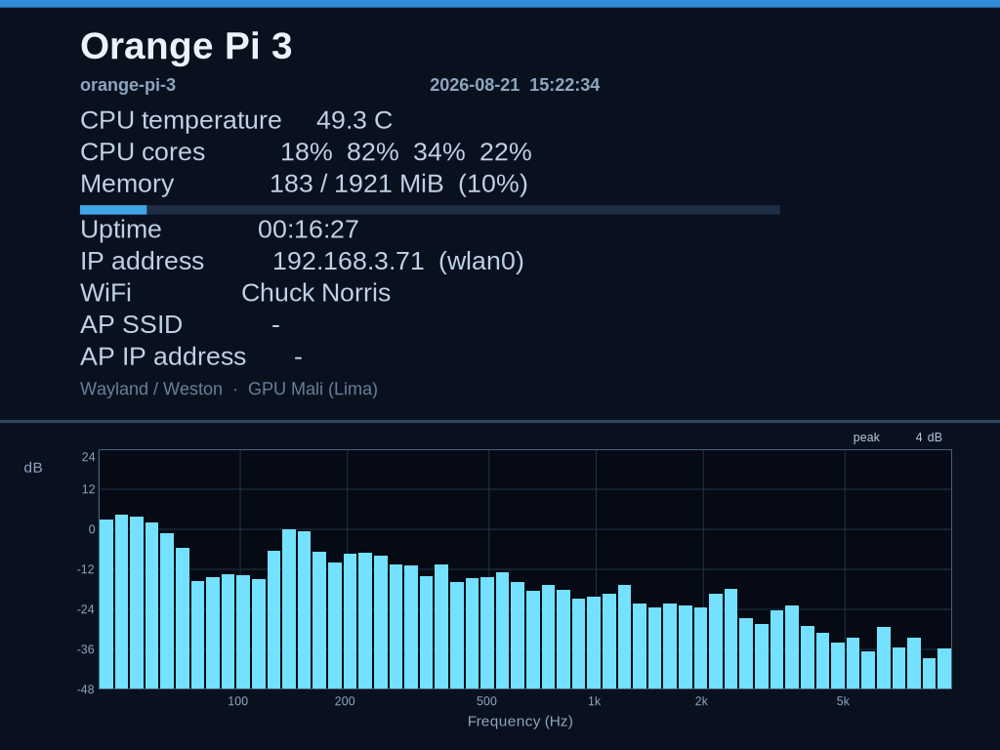

# Orange Pi 3 HDMI graphics stack (Weston + info-panel)

This directory packages the **HDMI real-time info panel** for the Khepri image on
Orange Pi 3 (Allwinner H6, Mali-T720). The stack is Wayland/Weston on mainline
DRM/KMS with Mesa **Lima** (not proprietary sunxi-mali, not Panfrost).

Related config outside this folder (required for a working image):

| Piece | Location |
|-------|----------|
| Distro features / Mesa providers | `meta-local/conf/distro/include/orangepi3-graphics.inc` (required from `build-orangepi3/conf/local.conf`) |
| Machine: `use-mailine-graphics`, OpenGL | `meta-local/conf/machine/orange-pi-3.conf` |
| Kernel DRM/Lima/THS fragments | `meta-local/recipes-kernel/linux/files/drm.cfg` |
| AC200 analog microphone | `meta-local/recipes-multimedia/ac200-audio/` (mixer + kernel inc) |
| Image packages | `core-image-khepri.bb` → `weston weston-init info-panel kmscube display-rf-blacklist ac200-audio` |

---

## What you see on HDMI



After boot (Wi‑Fi up, then compositor), a fullscreen **info-panel** client draws:

**Top ~56%**

- Hostname and local time  
- **CPU temperature** (°C) from `/sys/class/thermal` (prefer `cpu-thermal`) or hwmon  
- **Per-core CPU usage** (%) from `/proc/stat` deltas (needs ≥1 refresh interval between samples)  
- Memory used / total and a simple bar  
- IPv4 address and interface (prefers `wlan0`)  
- **WiFi SSID** via `/usr/sbin/iw dev wlan0 link`  
- Footer: Wayland/Weston · Mali (Lima)

**Bottom ~44%**

- Live **microphone spectrum** (AC200 analog codec, I2S3) as a **vertical bar** analyzer  
- X axis: **40 Hz – 10 kHz** (log scale); Y axis: **dB** (−48 … 24)  
- ALSA capture via `hw:CARD=ac200audio`; override with `INFO_PANEL_ALSA_DEVICE`  
- FFT **2048** / hop 128 @ 48 kHz (≈23.4 Hz/bin); **56** bars (max per band); spectrum redraw **~5 Hz** (a 0 ms poll + per-hop commits hard-reset the board)  
- Board metrics still update at **1 Hz**

---

## Architecture

```
┌─────────────────────────────────────────────────────────┐
│  info-panel (Wayland client, user weston)               │
│  Cairo → wl_shm ARGB buffer → xdg_toplevel fullscreen   │
└────────────────────────────▲────────────────────────────┘
                             │ wayland-0
┌────────────────────────────┴────────────────────────────┐
│  Weston 13 (drm-backend, MESA_LOADER_DRIVER_OVERRIDE=lima)│
│  --drm-device=$(cat /run/weston-drm-device)  e.g. card0  │
└────────────────────────────▲────────────────────────────┘
                             │ /dev/dri/card*
┌────────────────────────────┴────────────────────────────┐
│  Kernel modules (loaded late by weston-prepare-drm)     │
│  sun4i_drm + sun8i_mixer + sun8i_drm_hdmi + lima        │
│  (+ tcon / dw_hdmi via dependencies)                    │
└─────────────────────────────────────────────────────────┘
         HDMI-A-1  ·  GPU: Mali-T720 (Lima)  ·  CPU THS
```

**Why Lima, not Panfrost:** H6 Mali-T720 is Midgard. Panfrost is Bifrost/Valhall;
binding Panfrost breaks the GPU path. `drm.cfg` sets `CONFIG_DRM_LIMA=m` and
explicitly disables Panfrost.

**Why modules, not built-in:** DRM as `=m` avoids early-boot hangs if HDMI/GPU
probe fails; networking/SSH can still come up. Display drivers are **not**
auto-loaded at boot (see RF coexistence below).

---

## Boot sequence (WiFi-first, then HDMI)

HDMI pixel clocks / DRM probe on this board **interfere with AP6256 2.4 GHz
WiFi**: association can reach `COMPLETED`, then drop to `SCANNING` /
`operstate=down` while a stale IP remains. The graphics feature is designed
around that constraint.

```
1. Kernel boots; DRM modules exist on disk but are blacklisted
   (/etc/modprobe.d/blacklist-display-wifi.conf from display-rf-blacklist).
   udev does not autoload sun4i_drm / lima / sun8i_drm_hdmi / …

2. wifi.service → wifi-connect
   waits for wlan0, wpa_supplicant, wpa_state=COMPLETED, then DHCP.

3. wifi-roam.service (optional companion)
   compares measured RSSI of 2.4 vs 5 GHz and switches when the other is
   stronger by a dB margin (avoids flapping).

4. weston.service (After=wifi.service, Wants=wifi.service)
   ExecStartPre=+/usr/libexec/weston-prepare-drm.sh   # root despite User=weston
     · modprobe sun4i-drm, sun8i-mixer, sun8i-drm-hdmi, lima
     · wait up to ~45s for /dev/dri/card*
     · weston-pick-drm.sh → /run/weston-drm-device (HDMI card name)
   ExecStart: weston --drm-device=…

5. info-panel.service (After/BindsTo/PartOf=weston.service)
   waits for /run/wayland-0, then runs /usr/bin/info-panel as user weston.
```

Default target stays **`multi-user.target`** (not `graphical.target`) so SSH and
networking remain primary even if Weston fails.

### Why `ExecStartPre=+…`

`weston.service` sets `User=weston`. Without the systemd **`+`** prefix,
`modprobe` and writing `/run/weston-drm-device` run as weston and fail (no
`CAP_SYS_MODULE`, no permission). The `+` runs those ExecStartPre lines as root.

### Why `weston-prepare-drm` (not only `modprobe sun4i-drm`)

Blacklisting also blocks **dependent** HDMI pieces from udev. Loading only
`sun4i-drm` is not enough for a usable HDMI connector. `display_connector` must load first (asserts `ddc-en` / PH2) or EDID
stays empty and HDMI audio is silent despite a working ALSA card. Probe is often deferred
(“Couldn't get the HDMI PHY”, then bind), so `/dev/dri/card*` may appear
several seconds after `modprobe` returns. The helper loads the full set
(including `dw_hdmi_i2s_audio` for card `allwinner-hdmi`) and waits.

### Why `weston-pick-drm`

Weston must bind the **KMS card that owns HDMI-A-*** (e.g. `card0`), not a
render-only node. The script scans `/sys/class/drm/card*-HDMI-A-*/status`,
accepts `connected` (and `unknown` after PHY bind races), writes the card name
to `/run/weston-drm-device`. Shell uses `cut -d- -f1` instead of `${var%%-*}`
because systemd unit files treat `%%` specially.

---

## Packages in this directory

### `display-rf-blacklist/`

Installs `/etc/modprobe.d/blacklist-display-wifi.conf`.

- Prevents udev autoload of display DRM modules at boot.  
- **Manual** `modprobe` (as done by weston-prepare-drm) still works.  
- Without this, DRM often loads right after WiFi associates and kills 2.4 GHz.

### `weston-init/` (bbappend + files)

Overrides Poky’s `weston-init`:

| File | Role |
|------|------|
| `weston.ini` | DRM backend, no idle lock, `HDMI-A-1`, dark kiosk shell |
| `weston.service` | After wifi; root prepare; Lima env; tty7; WantedBy=multi-user |
| `weston-prepare-drm.sh` | Load blacklisted modules, wait for `/dev/dri`, pick card |
| `weston-pick-drm.sh` | Choose HDMI DRM card → `/run/weston-drm-device` |
| `weston-init.bbappend` | `PACKAGECONFIG += no-idle-timeout`, install helpers, enable unit |

Also pulls in stock Weston bits (socket, user `weston`, PAM autologin, etc.).

### `info-panel/`

Meson + Wayland client (`info-panel.c`) + `info-panel.service`.

- `SYSTEMD_AUTO_ENABLE = enable`, WantedBy=`weston.service`.  
- `RDEPENDS`: `weston-init`, `liberation-fonts`, `iw`.  
- Service sets `PATH` including `/usr/sbin` so `iw` is found as user weston.  
- `MESA_LOADER_DRIVER_OVERRIDE=lima` for any GL path (panel itself uses Cairo/shm).

### Image extra: `kmscube`

Installed for manual DRM/GL smoke tests (`kmscube`) with Weston stopped if needed.

---

## Kernel / firmware prerequisites

From `meta-local/recipes-kernel/linux/files/drm.cfg` (overrides meta-sunxi’s
`drm.cfg` when `use-mailine-graphics` is set):

- DRM sun4i / sun8i HDMI mixer / Lima as **modules**  
- CMA 128 MiB  
- `CONFIG_SUN8I_THERMAL=y` — H6 THS → `thermal_zone*`  
- `CONFIG_NVMEM_SUNXI_SID=y` — **required**; without SID/efuse the THS stays in
  deferred probe waiting for `thermal-sensor-calibration@14`, and the panel
  shows CPU temperature as **n/a**

Machine override:

```text
MACHINEOVERRIDES .= ":use-mailine-graphics"
MACHINE_FEATURES:append = " opengl"
```

---

## Systemd units (runtime)

| Unit | Enabled | Notes |
|------|---------|--------|
| `wifi.service` | yes | Must succeed before Weston (ordering) |
| `wifi-roam.service` | yes | Pick stronger band by RSSI; PartOf wifi |
| `weston.service` | yes | Starts DRM stack; may stress 2.4 GHz RF |
| `weston.socket` | yes | Triggered with weston |
| `info-panel.service` | yes | Tied to weston lifecycle |

Useful commands on the board:

```sh
systemctl status wifi weston info-panel --no-pager -l
journalctl -u weston -u info-panel -b --no-pager -l
cat /run/weston-drm-device
ls -l /dev/dri /sys/class/drm/card*-HDMI-A-*/status
cat /sys/class/thermal/thermal_zone*/type /sys/class/thermal/thermal_zone*/temp
iw dev wlan0 link
# panel PNG: see [root README](../../../README.md) (`hdmi-screenshot`)
```

Stop graphics (e.g. to debug WiFi RF):

```sh
systemctl stop info-panel weston
# optional: unload display modules
modprobe -r sun8i_drm_hdmi lima sun4i_drm 2>/dev/null || true
```

Start again (modules loaded by prepare script):

```sh
systemctl start weston info-panel
```

---

## Design decisions & problems this stack addresses

| Problem                                              | Mitigation                                                                                   |
|------------------------------------------------------|----------------------------------------------------------------------------------------------|
| HDMI RF drops AP6256 **2.4 GHz** after boot          | Blacklist DRM at boot; start Weston only **after** `wifi.service`; wifi-roam picks stronger band by RSSI |
| `wifi.service` “success” with dead link              | Separate wifi-connect (not graphics); wait for `COMPLETED` before DHCP                       |
| DRM autoload via DT modalias despite no modules-load | `display-rf-blacklist`                                                                       |
| `modprobe` as User=weston fails                      | `ExecStartPre=+…` / prepare script as root                                                   |
| Only `sun4i-drm` loaded → no HDMI connector          | prepare script also loads mixer + sun8i-drm-hdmi + lima                                      |
| Deferred HDMI PHY → empty `/dev/dri` briefly         | wait loop before pick-drm                                                                    |
| Wrong DRM node / systemd `%%` in shell               | pick-drm with `cut`; card written to `/run/weston-drm-device`                               |
| Panfrost bound on Mali-T720                          | `CONFIG_DRM_PANFROST` unset; force Lima                                                      |
| CPU temp always n/a                                  | enable `NVMEM_SUNXI_SID` so THS gets efuse calibration                                       |
| `iw` not in weston’s PATH                            | absolute path + `Environment=PATH=…` in info-panel.service                                   |
| graphical.target hides network failure               | stay on `multi-user.target`                                                                  |

Build and flash steps for the full image (including this stack) are in the
[root README](../../../README.md#build--flash).

---

## Layout of this directory

```text
recipes-graphics/
├── README.md                          (this file)
├── hdmi.png                           (sample info-panel screenshot)
├── display-rf-blacklist/
│   ├── display-rf-blacklist.bb
│   └── files/blacklist-display-wifi.conf
├── weston-init/
│   ├── weston-init.bbappend
│   └── weston-init/
│       ├── weston.ini
│       ├── weston.service
│       ├── weston-prepare-drm.sh
│       └── weston-pick-drm.sh
└── info-panel/
    ├── info-panel.bb
    └── files/
        ├── hdmi-screenshot.sh          → /usr/sbin/hdmi-screenshot
        ├── info-panel.service
        └── info-panel/
            ├── info-panel.c
            └── meson.build
```

---

## Limitations

- Enabling HDMI/DRM can still degrade or drop **2.4 GHz** WiFi; **5 GHz** is preferred when in range.  
- info-panel is a Cairo/shm client (not a GL UI). Weston uses **pixman** to composite it; Lima GL compositing of per-hop SHM commits hard-reset the board. kmscube still uses Lima.  
- Thermal zones require a kernel built with both `SUN8I_THERMAL` and `NVMEM_SUNXI_SID`.  
- HDMI cable must present a connector (`connected`, or `unknown` after late PHY bind); fully `disconnected` leaves pick-drm failing and Weston restarting.
